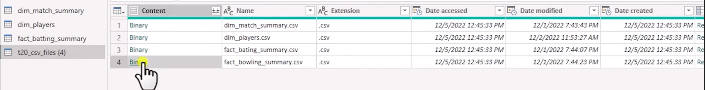
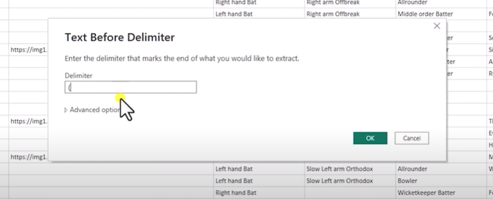
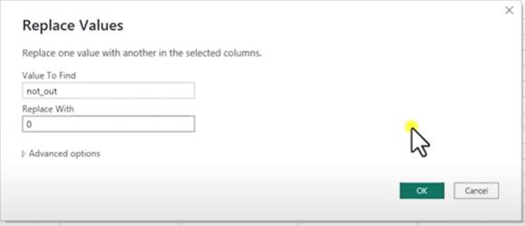
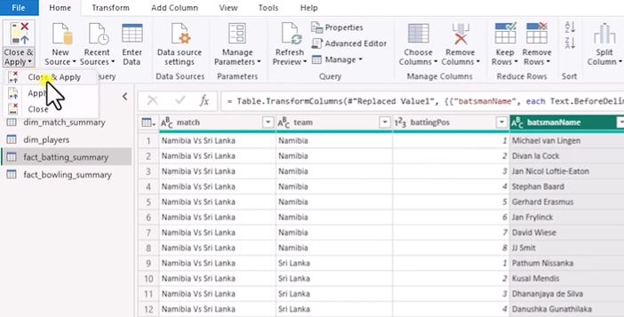

# Data-Analytics-Project

Team 11 predictor on previous T20WC

# Overview

# Problem statement

# Requirement scoping

# Data Collection

# Data cleaning and transformation in Python Pandas

# Data transformation in Power Query

Installation of power Bi. You can install the powerBi application from the following link: https://powerbi.microsoft.com/en-us/desktop/. Power BI is a business analytics service by Microsoft that allows users to visualize and analyze data, share insights across an organization, or embed them in an app or website. It provides a set of tools for transforming raw data into meaningful information through interactive reports and dashboards.

# Following are the steps:

### Step 1:

Download the Power BI Desktop application from the link provided above.

### Step 2:

Install the application and open it.

### Step 3:

Give a file name to your report and click on the save button.


### Step 4:

Click on the Get Data button and select the data source from which you want to import the data. In this case, we are importing the data from an CSV file.


### Step 5:

After importing the data, you can see the data in the Power BI application. You can perform various operations on the data such as filtering, sorting, and grouping.

### Step 6:

Power query is a component of Power BI that allows you to import, transform, and load data into Power BI. It is used to connect to the data source, perform data transformation, and load that data into Power BI. You can perform various operations on the data such as filtering, sorting, and grouping.

#### To perform data transformation in Power Query, follow the steps below:

##### Step 6.1:

Create duplicate files to perform multiple operations or transformation on the data.



##### Step 6.2:

After expanding all the files now looking at the data and performing some data transformation operations.
Look for the coloumn name properly sometimes it may not be added properly.
To add them just few simple steps

> Transform >> Use First Row as Headers
> 

> > You can also look at the changes you made through Query applied tab


##### Step 6.3:

Removing unwanted characters from the data using extract and replace function.

> Transform >> Extract Values >> text before delimiter
>  

##### Step 6.4:

We can also perform basic tansfromations such as sorting and filtering the data.

> Transform >> Sort

##### Step 6.5:

To remove duplicate data

> Home >> (right click on the column) Remove Duplicates
> 

##### Step 6.6:

Creating a new column using the Conditonal column using some conditions. It just works as simple if else condition.


##### Step 6.7:

Creating columns on existing columns data by 'Custom Column' option.

```
Balls = overs1 * 6 + overs2
```

Here balls is a new column created by the existing columns overs1 and overs2. balls refers to total balls bowled by a bowler.


##### Step 6.8:

For replacing the values in the column we can use the replace values option.

> Home >> Replace Values

>  > 

##### Step 6.9:

The final step is to load the data into Power BI. You can perform many more transformations that are required for your dataset accordingly. You can load the data into Power BI by clicking on the Close & Apply button.

> Home >> Close & Apply
>  

# Data modeling and building parameters


# Build dashboard in Power BI
