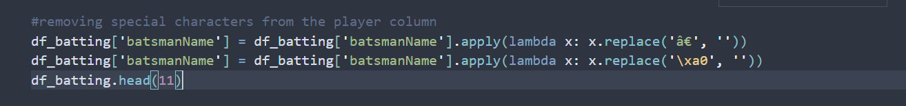

# MY-11

Team 11 predictor on previous T20WC

# Overview

In my project called MY-11, I used Power BI and Python Pandas to analyze data from the T20 World Cup 2022. I cleaned up and organized the data to find important details about matches, teams, players, runs, and wickets. The main goal was to create a useful dashboard in Power BI that showed how teams performed, which players were most impactful, and how matches turned out. Additionally, I made a tool to predict the best Dream 11 fantasy cricket team based on these insights, helping users make smarter choices for their fantasy leagues.

# Requirement scoping

- Perform data analysis on the T20 World Cup 2022 dataset.
- Cleaned and transformed dataset ready for analysis.

* Include batting position filters for different player roles (e.g., opener, middle-order, finisher).
* Ensure accurate and up-to-date data integration for player statistics.
* Optimize dashboard performance for smooth user experience.
* Conduct user testing to validate the ease of use and functionality of the "My 11" dashboard.
* Provide documentation for project understanding and future maintenance.

# Data Collection

We will collect data for the 'My 11' project from specific [Sources](https://codebasics.io/resources) containing player details, match details (including match ID), batting summary, and bowling summary related to the T20 World Cup 2022. These sources provide detailed information on player attributes, match-specific data, batting performances, and bowling statistics. The collected data from these sources will be utilized to populate the 'My 11' dashboard in Power BI, facilitating user-friendly filtering and selection of the best cricket team based on batting position and available bowling summaries.

# Data cleaning and transformation in Python Pandas

    This report outlines the initial steps of data preprocessing for the 'My 11' project, specifically focusing on importing and creating a Pandas DataFrame from the T20 World Cup 2022 match results JSON file.

## Data Import and DataFrame Creation

    1. Data Import:
        The code snippet reads the T20 World Cup match results data from a JSON file using the json.load() function.
    2. DataFrame Creation:
        The JSON data is converted into a Pandas DataFrame named `df_match` using pd.DataFrame().


## Renaming Columns in DataFrame

    1. Renaming Columns:
    The df_match DataFrame's 'scorecard' column was renamed to 'match_id' using the rename() method with inplace=True.


## Creating Match IDs Dictionary

        1. Creating Match IDs Dictionary:
            A dictionary named match_ids_dict was created to map team matchups to their corresponding match IDs from the df_match DataFrame.


## Data Transformation

    1. Handling Dismissals:
        * Created a new column 'out/not_out' based on whether a player was dismissed or not, using a  lambda function with apply().


    2. Dropping Columns:
        * Removed the 'dismissal' column from the df_bat DataFrame using drop() with axis=1.

    3. Cleaning Batsman Names:
        Removed special characters ('â€' and '\xa0') from the 'batsmanName' column using replace() with lambda functions.



    4. Mapping Match IDs:
        Mapped match IDs from match_ids_dict to the 'match' column in df_batting to associate batting statistics with match IDs.


## Conclusion

The additional data cleaning and transformation steps successfully prepared the T20 World Cup batting summary data (df_batting) for further analysis and integration with other datasets. The cleaned DataFrame now contains relevant batting statistics, player dismissal status, and associated match IDs, facilitating comprehensive analysis and visualization in Power BI.

# Data transformation in Power Query

Installation of power Bi. You can install the powerBi application from the following link: https://powerbi.microsoft.com/en-us/desktop/. Power BI is a business analytics service by Microsoft that allows users to visualize and analyze data, share insights across an organization, or embed them in an app or website. It provides a set of tools for transforming raw data into meaningful information through interactive reports and dashboards.

# Following are the steps:

### Step 1:

Download the Power BI Desktop application from the link provided above.

### Step 2:

Install the application and open it.

### Step 3:

Give a file name to your report and click on the save button.


### Step 4:

Click on the Get Data button and select the data source from which you want to import the data. In this case, we are importing the data from an CSV file.


### Step 5:

After importing the data, you can see the data in the Power BI application. You can perform various operations on the data such as filtering, sorting, and grouping.

### Step 6:

Power query is a component of Power BI that allows you to import, transform, and load data into Power BI. It is used to connect to the data source, perform data transformation, and load that data into Power BI. You can perform various operations on the data such as filtering, sorting, and grouping.

#### To perform data transformation in Power Query, follow the steps below:

##### Step 6.1:

Create duplicate files to perform multiple operations or transformation on the data.


##### Step 6.2:

After expanding all the files now looking at the data and performing some data transformation operations.
Look for the coloumn name properly sometimes it may not be added properly.
To add them just few simple steps

> Transform >> Use First Row as Headers
> 

> > You can also look at the changes you made through Query applied tab


##### Step 6.3:

Removing unwanted characters from the data using extract and replace function.

> Transform >> Extract Values >> text before delimiter
>  

##### Step 6.4:

We can also perform basic tansfromations such as sorting and filtering the data.

> Transform >> Sort

##### Step 6.5:

To remove duplicate data

> Home >> (right click on the column) Remove Duplicates
> 

##### Step 6.6:

Creating a new column using the Conditonal column using some conditions. It just works as simple if else condition.


##### Step 6.7:

Creating columns on existing columns data by 'Custom Column' option.

```
Balls = overs1 * 6 + overs2
```

Here balls is a new column created by the existing columns overs1 and overs2. balls refers to total balls bowled by a bowler.


##### Step 6.8:

For replacing the values in the column we can use the replace values option.

> Home >> Replace Values

>  > 

##### Step 6.9:

The final step is to load the data into Power BI. You can perform many more transformations that are required for your dataset accordingly. You can load the data into Power BI by clicking on the Close & Apply button.

> Home >> Close & Apply
>  

# Data modeling and building parameters


# Build dashboard in Power BI


## Dashboard pictures


This was not the best Playing 11 of the T20WC-2022 but this was `MY-11` (personal) Favorite Playing 11 of the T20WC-2022. 


